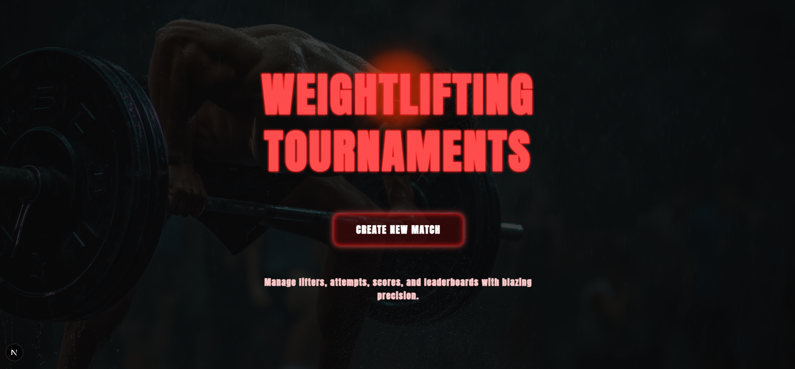
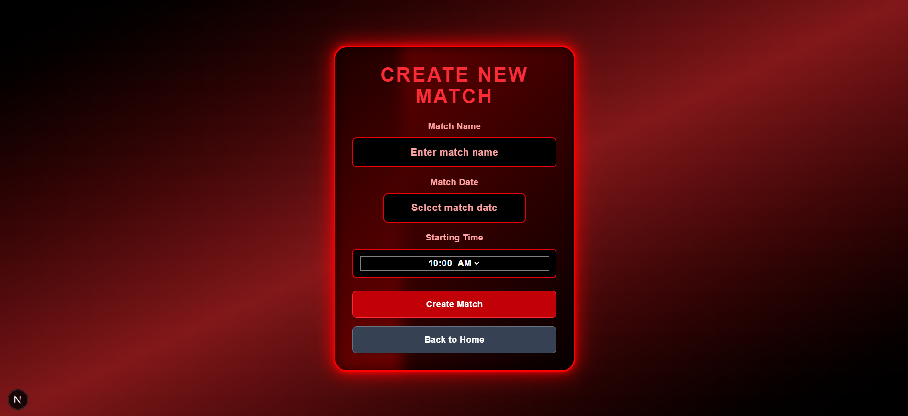
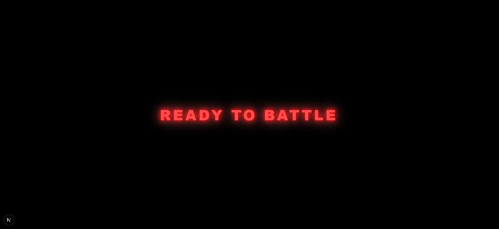
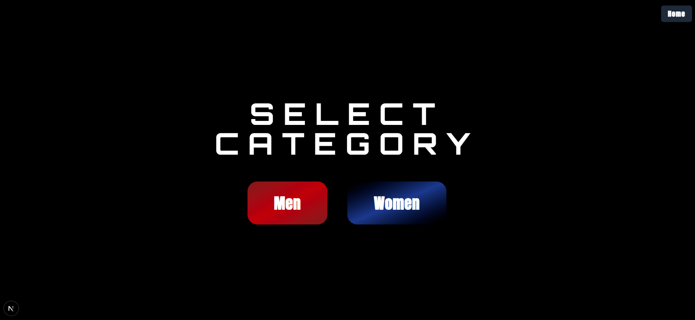
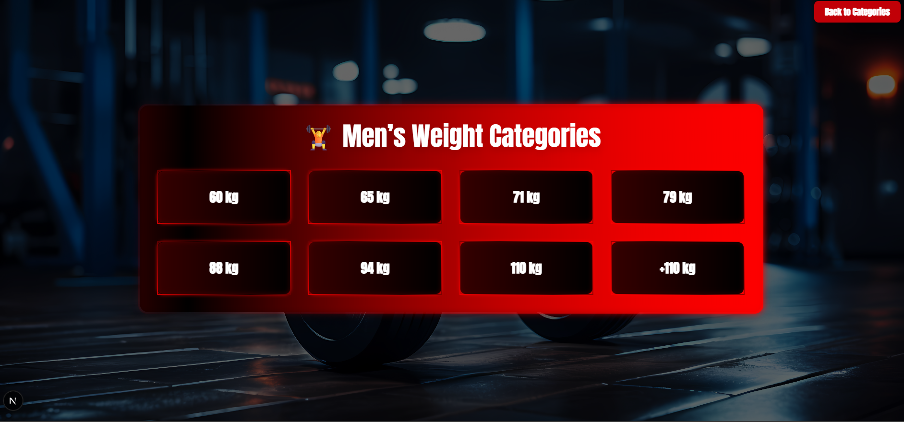
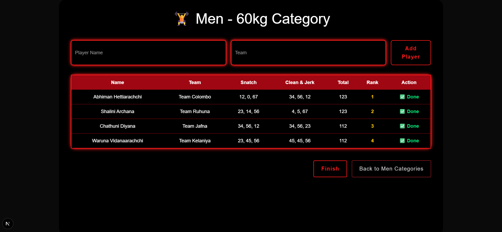
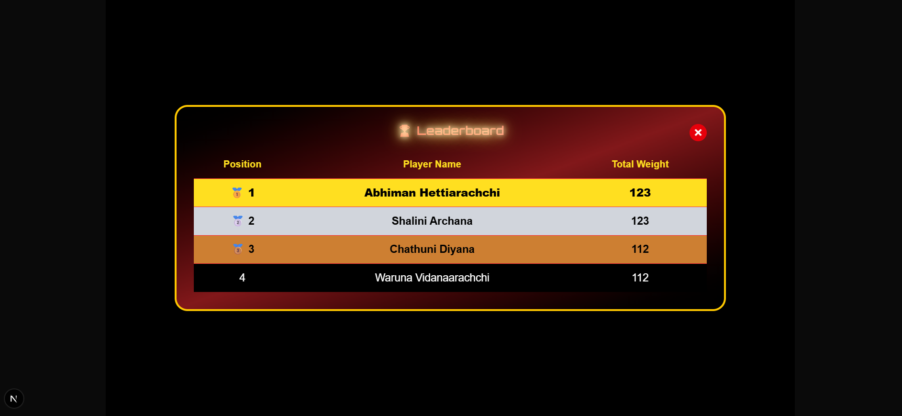

# 🏋️‍♂️ Weight Lifting Tournament Scoring System

> **Developed by**: Shalini Archana Vidanaarachchi
> A high-impact real-time weightlifting scoring web app built for modern competitions.

## 🎯 Overview

The **Weight Lifting Tournament Scoring System** is a full-stack, responsive, and real-time web application designed to manage weightlifting matches like a professional tournament environment.

With a bold **red-and-black game-inspired theme**, animated interactions, and a powerful scoring system, this platform ensures a smooth experience for organizers, judges, and athletes.

## 🌟 Features

### 🔐 Authentication
- Secure login & signup using **Firebase Authentication**
- Each user has access only to their own matches

### 🧠 Match Management
- Create unlimited matches per user
- Matches stored per user with Firestore isolation
- Categorized as **Ongoing** and **Finished**

### 📊 Real-Time Scoring System
- Input snatch and clean & jerk attempts (3+3)
- Auto-calculated scores and live ranking
- Leaderboard updates instantly as values are entered

### ⚙️ Tech Highlights
- Built with **Next.js 14 App Router** & **React**
- Styled using **Tailwind CSS** with custom animations
- Realtime database and auth powered by **Firebase**
- Data formatted and managed using **JSON**
- HTML5 components for accessible, semantic layout

### 🎮 Design Theme
- Red & Black esports-inspired tournament vibe
- Glitch effects, pixel-style fonts, animated UI
- Fully responsive for desktop, tablet, and mobile

## 📸 Screenshots

  
  
  
  
  
  
  
  
  
 

## 🚀 Getting Started

### 1️⃣ Clone the repository

git clone https://github.com/shaliniarchana/Weight-Lifting.git
cd Weight-Lifting

### 2️⃣ Install dependencies

npm install

### 4️⃣ Start the dev server

npm run dev

Visit [http://localhost:3000](http://localhost:3000)

## 🤝 Contributions

Contributions are welcome!

* Report bugs
* Suggest features
  
Let’s build this into a global open-source tournament platform!

## 📬 Contact

Made with ❤️ by **Shalini Archana**
📧 Email: [sliitshalini@gmail.com](mailto:sliitshalini@gmail.com)
🔗 [LinkedIn](https://linkedin.com/in/shalini-archana-vidanaarachchi-417a08314)
💻 [GitHub](https://github.com/shaliniarchana)

## 🏁 Final Thoughts

This system redefines how weightlifting tournaments are conducted — digitally, in real-time, and with professional polish.
Thank you for checking it out! Let’s lift the sport to new heights. 💪🔥

